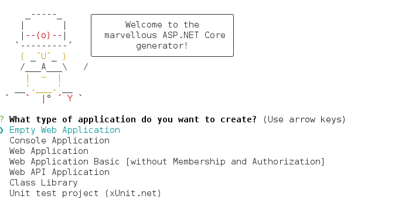
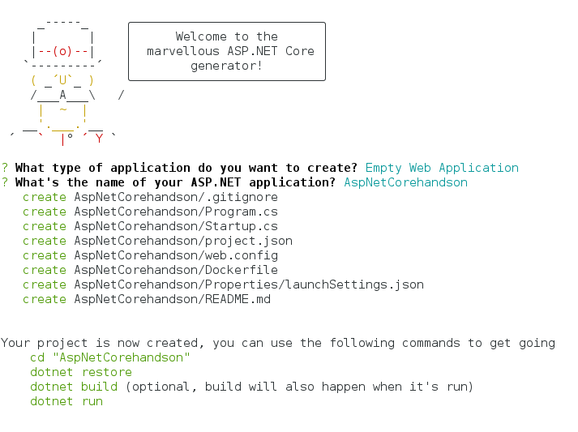
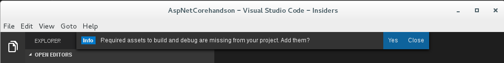
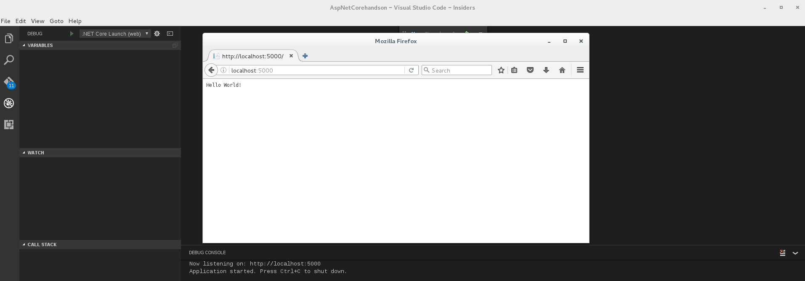

このハンズオンは[Hello World, ASP.NET Core 1.0!](https://blogs.msdn.microsoft.com/nakama/2016/07/07/aspnetcore10/)をVisual Studio Code on Linux 向けに焼き直したものになります。

### prerequired

TBD
[こちらを参照](https://github.com/tanaka-takayoshi/dotnetcore_on_linux_handson/blob/master/README.md#0-環境構築)

### Part1 

まずはじめに、空のASP.NET Core Web Applicationプロジェクトを作成します。``dotnet new -t web`` の場合、MVCのフルセットが作成されるため、今回はYeamanを利用します。``yo aspnet``と入力するとウィザード形式で選択することができます。

```
$ yo aspnet
```

上下矢印で移動できますが、初期値の「Empty Web Application」を選択します。


プロジェクト名を入力します。Yeomanはカレントディレクトリにプロジェクト名と同じディレクトリを作成し、そのディレクトリ内にファイルを作成します。現状、プロジェクト名とディレクトリ名および既定の名前空間が同じ値になります。


作成されたディレクトリでVisual Studio Codeを開きます。Insiderではない場合、``code``コマンドです。
```
$ code AspNetCorehandson
```

Insiderの場合は``code-insiders``コマンドになります。
```
$ code-insiders AspNetCorehandson
```

開くと、アセットのダウンロードを求められるのでYesを選択します。``.vscode``ディレクトリが作成されます。


``F5``キーを押してデバッグ起動します。左側のアイコン一覧から虫アイコンを選び、緑矢印アイコンでも起動できます。自動でブラウザが立ち上がりメッセージが表示されるはずです。起動しない場合は、http://localhost:5000 を開いてください。


Visual Studio Codeに表示されている赤四角アイコンを押すなどしてデバッグを修了します。``project.json``ファイルを開いて、下記の様に修正します。なお、本家ではSQLServerを利用していますが、localdb(mdfファイル)がLinux上で利用できないため、SQLiteを指定しています。

dependenciesに以下のライブラリを追加。
```
  "dependencies": {
  //略
    "Microsoft.AspNetCore.Mvc": "1.0.0",
    "Microsoft.AspNetCore.StaticFiles": "1.0.0",
    "Microsoft.AspNetCore.Mvc.TagHelpers": "1.0.0",
    "Microsoft.EntityFrameworkCore": "1.0.0",
    "Microsoft.EntityFrameworkCore.Sqlite": "1.0.0",
    "Microsoft.EntityFrameworkCore.Design": {
      "version": "1.0.0-preview2-final",
      "type": "build"
    }
  }
```

toolsに以下のライブラリを追加。
```
  "tools": {
    "Microsoft.AspNetCore.Server.IISIntegration.Tools": "1.0.0-preview2-final",
    "Microsoft.EntityFrameworkCore.Tools": "1.0.0-preview2-final"
  }
```

追加したら、restoreしてエラーなく完了することを確認します。

```
$ dotnet restore
```

### Part2

Part2では、実際にデータベースファイルからデータを取得します。用意されてあるファイルを利用することも可能ですが、EF Migrationでのデータベースファイルの生成も説明します。

データベースファイルの配置場所として、App_Dataディレクトリを作成します。公開しないファイルであるためwwwroot内である必要はなく((むしろ公開するのはよくない))、ディレクトリ名は任意です。また、Modelsディレクトリを作成し、Pubs.csファイルを作成さいます。

```
$ mkdir App_Data
$ mkdir Models
$ touch Models/Pubs.cs
```
Pubs.csはこのファイルの様に記述します。

[Pubs.cs](https://github.com/tanaka-takayoshi/dotnetcore_on_linux_handson/blob/master/aspnetcore/AspNetCorehandson/Models/Pubs.cs)

TBD: EFに関する説明

さて、データベースファイルですが、サンプルを利用する場合はこちら（TBD）からダウンロードして、App_Dataディレクトリに配置してください。
一から作成する場合は、EFのMigrationツールを利用します。最初のコマンドの最後の引数はマイグレーション名で任意の名前でよいです。
なお、これで作成されたデータベースは空ですので、適当にレコードを入力してください（SQL用意するかも、TBD）。
```
$ dotnet ef migrations add InitialSetup
$ dotnet ef database update
```

ここまでできたら確認のため、Startup.csファイル内のConfigureメソッドにある``app.Run``を書き換えてDBにアクセスできるか実行してみましょう。
```
app.Run(async (context) =>
  {
    using (PubsEntities pubs = new PubsEntities())
    {
      var query = pubs.Authors.Where(a => a.State == "CA");
      await context.Response.WriteAsync(query.Count().ToString());
    }
  });
```

サンプルファイルを利用した場合は15と表示されるはずです。
